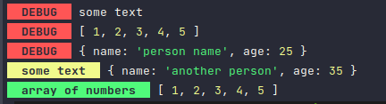

# Print colored text to the terminal.

## Basic usage

```js
const debug = require('@thiago-tanaka/debug')

debug.red("some text")
debug.red([1,2,3,4,5])
debug.red({name: "person name", age: 25})
debug.yellow({name: "another person", age: 35}, "some text")
debug.green([1,2,3,4,5], "array of numbers")

```

## result



## installation

```console
npm install @thiago-tanaka/debug
```
